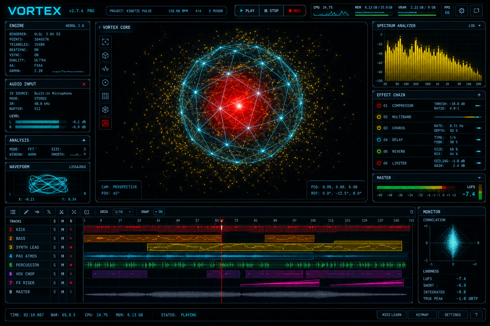

# VORTEX // Audio-Reactive WebGL Instrument
<p align="center">
  <a href="https://zazieproductions.github.io/vortex-av-engine/">
    
  </a>
</p>

<p align="center">
  <a href="https://zazieproductions.github.io/vortex-av-engine/">
    <strong>⌰⟟ ENTER THE VORTEX ⍧⏧</strong>
  </a>
</p>

**VORTEX** is an experimental browser-based audiovisual instrument that translates uploaded audio into a responsive three-dimensional signal environment.

Rather than functioning as a conventional music visualizer, the project treats audio analysis as a control system. Frequency bands extracted through the Web Audio API continuously reshape a procedural WebGL scene: bass expands an inner core, midrange energy deforms a wireframe polyhedron, and high-frequency transients disperse a surrounding particle field. A dense, fictional modular-workstation interface exposes the system as an imagined creative tool rather than a passive animation.

## Project concept

VORTEX explores how sound can become spatial behavior, interface feedback, and visual material. It sits between:

- browser instrument design
- audio-reactive installation software
- generative and procedural graphics
- speculative music-interface design
- real-time signal visualization
- creative coding for performance and media art

The interface borrows the visual grammar of modular synthesis environments, digital audio workstations, scientific instrumentation, and cybernetic control rooms. Its controls and displays form a diegetic operating system for navigating a live audio signal.

## Features

- Local drag-and-drop audio loading
- Audio playback entirely inside the browser
- Real-time frequency and waveform analysis
- Audio-reactive Three.js geometry deformation
- Bass-controlled core scaling
- Mid-frequency mesh displacement
- High-frequency particle expansion
- Adjustable animation speed and distortion depth
- Interactive modulation matrix
- Frequency-spectrum and waveform canvases
- Transport controls, playback timeline, system logs, and simulated telemetry
- Responsive WebGL resizing
- No server, build process, account, or uploaded audio required

## Signal mapping

| Audio data | Visual response |
| --- | --- |
| Low frequencies | Scale and pulse of the inner core |
| Midrange energy | Displacement of the outer icosahedral mesh |
| High frequencies | Expansion and recovery of the particle field |
| Playback position | Timeline and transport readout |
| User parameters | Animation rate and deformation intensity |

This mapping gives the visual system a legible internal logic: the image is not merely synchronized to amplitude, but divided into multiple behaviors driven by distinct spectral regions.

## Technology

- **JavaScript** for state, interaction, animation, and signal mapping
- **Web Audio API** for decoding, playback, and real-time analysis
- **Three.js / WebGL** for the deforming mesh, particles, camera, fog, and lighting
- **Canvas 2D** for frequency and waveform displays
- **Tailwind CSS** plus custom CSS for the dense workstation interface
- **Google Fonts** for the technical display typography

## Run locally

No installation is required. Clone the repository and open `index.html` in a modern browser:

```bash
git clone https://github.com/YOUR-USERNAME/vortex-av-engine.git
cd vortex-av-engine
open index.html
```

For the most consistent browser behavior, serve it locally:

```bash
python3 -m http.server 8000
```

Then visit `http://localhost:8000`.

## Interaction

1. Drag an MP3, WAV, or other browser-supported audio file into the input panel.
2. Press **Play**.
3. Adjust **Speed** to alter the motion rate.
4. Adjust **Distortion** to intensify mesh deformation and bass response.
5. Toggle cells in the modulation matrix as part of the interface experiment.

Audio remains local to the user's browser. The project does not transmit or store uploaded files.

## Repository structure

```text
vortex-av-engine/
├── index.html
├── assets/
│   ├── css/
│   │   └── styles.css
│   └── js/
│       └── app.js
├── docs/
│   └── architecture.md
├── CONTRIBUTING.md
├── LICENSE
└── README.md
```

## Design significance

The project demonstrates a creative-technology workflow that combines frontend engineering, procedural graphics, digital signal analysis, interaction design, and sound-art thinking in one browser artifact. It is intentionally presented as a fictional instrument: the visual language helps users understand the audio-reactive system while also giving the software a distinct narrative identity.

## Current limitations

- The modulation matrix is currently an interface study rather than a complete routing engine.
- Several oscillator and EQ controls are visual prototypes.
- Large audio files may take longer to decode depending on the browser and device.
- The dense workstation layout is optimized primarily for desktop displays.
- Three.js and Tailwind are currently loaded from CDNs.

## Development roadmap

Potential extensions include:

- microphone and line-input support
- MIDI controller mapping
- configurable frequency-band routing
- a true node-based modulation graph
- shader-based displacement and post-processing
- recording and exporting visual performances
- preset saving through local storage
- OSC or WebSocket control for installation use
- Raspberry Pi or ESP32 sensor input
- projection and fullscreen performance modes

## Suggested GitHub topics

`creative-coding` `web-audio-api` `threejs` `webgl` `audio-reactive` `audiovisual` `generative-art` `interactive-art` `browser-instrument` `sound-visualization` `procedural-animation` `speculative-interface`

## License

Released under the [MIT License](LICENSE).
